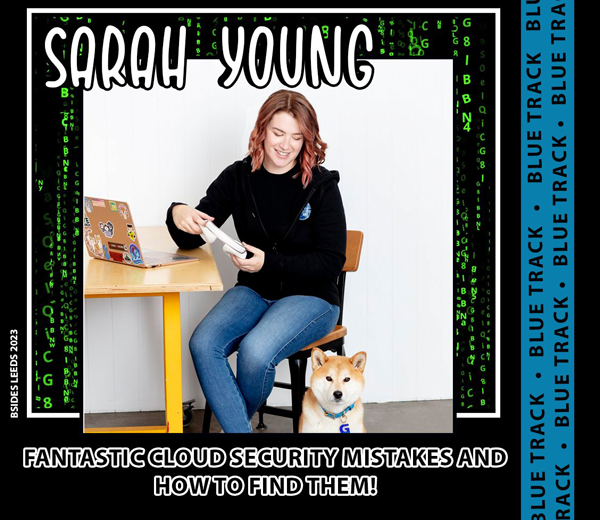
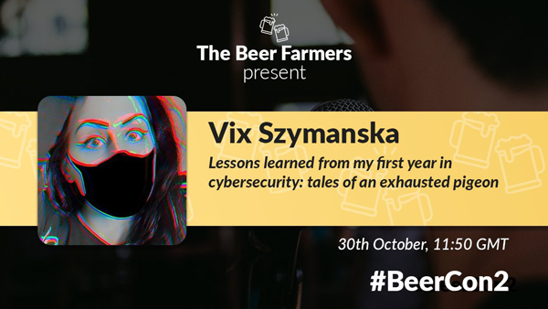
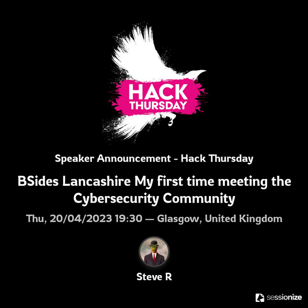
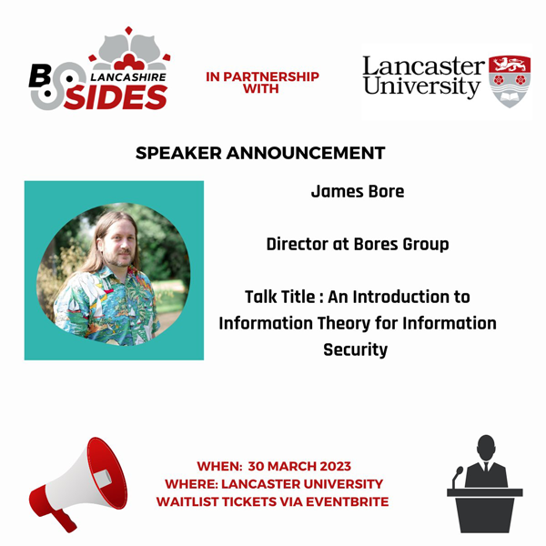

# Organisation and planning

Generally speaking, planning and executing a traditional conference will follow the following pattern:

* Concept stage
* Support stage
* Promotion stage
* Building stage
* Conference stage
* Post conference stage

You should have clearly defined goals that you want to achieve at the end of each stage, and sometimes these stages may overlap, or repeat themselves.

Things will change, go wrong, or not quite stick to the original plan and that's **absolutely fine**. Understanding that things might go wrong, planning for those eventualities, and having contingencies in place can massively help to keep the event running smoothly.

## Advisors 

Having a friendly face that's done it all before can massively reduce the pressure of running an event. Their guidance and experience can help because most of the issues that crop up, they will have faced and overcome. Conference organisers are generally disposed to assisting others run an event... provided you aren't trying to run one in competition with them ;)...

## After party

Many conferences now offer an official after party. Often a sponsor slot will be dedicated to purely sponsoring the after party activities, food, or bar tab.

If you're offering a free bar tab, or drinks/food tokens, this needs to be managed carefully especially if the after party is hosted in an area where members of the public may roam in. Wrist bands, physical tokens, or even conference badges can be used as a validation method that the person asking for a free round of drinks was a genuine attendee.

Considerations should be given towards attendees around the theme of the after party. For example: if the after party is a BBQ event, that might not cater for vegans/vegetarians. Similarly, if the after party is solely based around free alcoholic drinks, attendees may be non-drinkers.

Care should be taken to avoid dilution of attendees between the conference and the after party. You can read more about dilution, and how to avoid it, on the [types of conference guide](types_of_conference.md#in-person).

## AV & tech

Decide early about whether you want the talks recorded and shared online. Even if you choose not to record or stream talks, you'll need to consider projectors, screens, backup laptops, as well as the myriad of cables to connect devices to the projector (because not everyone has HDMI anymore).

Having a bag of cables, clickers, dongles, usb sticks, batteries, and testing the equipment *before* the conference is highly recommended.

> An "MVP" track pack would be a projector, an HDMI cable, USB memory stick, USB clicker, a power extension lead, and a laptop capable of outputting HDMI and accepting both a USB memory stick and clicker at the same time.

When it comes to recording/streaming talks on the day, infosec conferences benefit from having the wonderful [Cooper](https://twitter.com/Ministraitor) – and his rigs – on hand to help at most conferences. If you're planning on using his rigs, or calling in his services, please [donate a mate](https://administraitor.video/buy_me_a_mate.html) or send him some sort of thank you. You can find his [full (and incredibly modest) terms](https://administraitor.video/organizers/requirements.html) on his website, [administraitor.video](https://administraitor.video). Simply put the man is a legend and donates a ridiculous amount of his time, experience, knowledge, and patience, helping film infosec conferences around the world.

## Branding

While branding may be considered a "nice to have" element of the conference, it can make a huge impact to many aspects you might not have considered. Similarly, sponsors may be put off giving money (or haggling down the amounts) if the conference looks a bit "too cheap" or that you haven't given any care in its' presentation.

Social media promo images, [speaker cards](#speaker-cards), schedule books, and even slide templates (for opening & closing remarks) can make such a difference to the overall feel of the conference if planned for in advance. PSD and AI templates are freely available online for various social networks to ensure sizing is correct for each platform.

Consider creating header banner images that organisers, volunteers, speakers, and attendees can add to their social media profile to increase publicity around your conference.

Using templates provided by online tools, such as [Canva](https://canva.com), can help make this process much easier.

### OBS overlays

TBC

### Speaker cards

Speaker cards can drive interest in the event as they normally are shared by the speaker, and sometimes the company they work for, on social media. Taking time to design a speaker card that fits with the conference theme can be very worthwhile and make your event stand out.

Care should be taken to ensure speaker, or sponsor, cards don't "wash out" sponsor logos or speaker pictures. Sponsors can often be **very** protective of their brand and how it's presented, hence always check their brand guidelines, if they're available.

**Examples of speaker cards:**

### Videos

Although rare to see as they require a higher effort on production, intro and promo videos can help give your conference an extra flair.

**Example videos:**

BeerCon2 intro video

BeerCon3 promo video

BeerCon3 intro video

## Broadcast

Broadcasting your conference online can make your event accessible to attendees that can't physically make your conference. A stable internet connection and a dedicated broadcast machine, with sufficient performance, is required to make this as solid as possible.

It's encouraged to read the full [broadcasting guide](/guides/broadcast.md) and tailor it to your conference (whether in-person, virtual, or hybrid).

## Budgeting

Understand exactly how much it'll cost to deliver a Minimum Viable Product (MVP) version of your conference and add on the additional "nice to have" bits later. Looking at other conferences' sponsor packs can be a good reference point to understand

Many sponsors will require an invoice to be sent to them and will pay within their own payment terms. This can be immediate, 14/30/60/90 days after invoice submission, randomly without notice, or even after the conference has run. Planning your budgets in accordance with when money is due is very recommended and while it may be tempting to stick things on a credit card in the interim, care should be taken to ensure the sponsors will pay on the time you think. It's not uncommon for organisers to be out of pocket or have additional fees they weren't initially expecting at the end of a conference.

Be aware that accepting credit card payments, or selling tickets on platforms like Eventbrite can incur fees. These fees may be a small amount of money in the grand scheme of things but if you're running

Having [money left over](post_conference.md#money) in the bank account after a conference is an ideal situation to be in – especially if there's plans to re-run the conference at a future date (or help out another conference).

## Backups

Speakers can drop out for a variety of reasons – both in person and virtual – so planning for an eventuality where one, or more, speakers drop out is a very worthwhile endeavour. Having reserve talks (with speakers), a panel, mini-workshop, or fun item able to be dropped in to the schedule at the last minute.

Similar to speakers, there's a possibility an organiser or volunteer may drop out on the day. You should aim to build resilience into your conference so that, if an organiser or volunteer were to drop out, their responsibilities can either be spread among the remaining volunteers or reserve volunteers can be called upon on the day.

Having a shared document repository or password manager can help ensure that the event will continue regardless of what challenges it faces.

The show must go on.

## Call for papers (CFP)

Putting out a call for papers (or call for presentations), commonly called CFP, as early as possible can maximise the quality submissions you will receive.

Using platforms like [papercall.io](https://papercall.io), [sessionize](https://sessionize.com/), or even a simple [Google form](https://docs.google.com/forms) can make the CFP submission and sift process far easier to manage.

Making it clear what format the CFP takes (whether it's fully open, semi-anonymised, or fully anonymised) allows speakers to know where they stand upon submission.

In a **fully open** CFP process, no speaker information is redacted from a submission and speakers are aware of who is making the call on whether to accept their talk or not.

In a **semi-anonymised** CFP process identifiable speaker information, review board comments, or the identity of the CFP review board can be redacted during the sift phase. Semi-anonymous reviews can be useful to avoid bias - or the perception of bias - between speakers and the review board themselves.

In a **fully anonymised** CFP process, identifiable speaker information, review board comments, and the CFP review board themselves are completely anonymous. This anonymity avoids any bias, either perceived or actual, in selection or between the review board. It's not uncommon for fully anonymous CFP processes to remain sealed long after the conference has passed.

### Attracting submissions

TBC

### Sift

Sifting through CFPs can feel like a daunting task, especially if you've received a large number. It's highly recommended to have a cohort of people to review talks to avoid any bias and have a scoring system in place to rank various talks based on general fit, theme, topic, etc.

Rejecting speakers can be one of the hardest parts of the entire CFP process. Giving speakers constructive feedback as to why they weren't successful is always recommended.

## Code of conduct

Having a code of conduct for your conference allows speakers, sponsors, attendees, and volunteers to feel safe and welcome. You can use a well known, widely used, code of conduct such as the [Berlin code of conduct](https://berlincodeofconduct.org/) or design your own if you wish.

## Controversy

While the vast majority of conferences go ahead without a single hitch, you should be mindful of who's involved, or attending, your conference and if there may be any negativity directed towards crew, speakers, sponsors, the venue, or indeed other attendees. You should also take into consideration if sponsors are particularly controversial either in general, or region specific and having a plan to mitigate any issues that may arise.

Potential controversy, or the assumption of such, can often be completely avoided by a having a good, coherent, [code of conduct](#code-of-conduct) in place beforehand.

## Comms strategy

Having an effective communication strategy is important. Speakers, attendees, sponsors, and even volunteers like to be kept in the loop at every stage of the plan. Having regular check-ins with speakers, volunteers, and sponsors before the event helps to avoid no-shows on the day.

## Capture the flag (CTF)

TBC

## Food

TBC

## Green room

Having a dedicated room on site where speakers can dump their bags, rehearse their talk, and chat with volunteers is recommended. Supplying the green room with water, caffiene, and biscuits. Speakers can get incredibly nervous and forget to eat or drink before their slot. Ensuring they have had some coffee, a biscuit, or even a glass of water before taking to the stage to present can avoid any fainting episodes.

Virtual only conferences benefit from the simplicity of creating a green room/private area for speakers to interact with organisers, volunteers, and other speakers. Although simple, it's recommended not to forget this step as speakers may have technical questions they'd rather not ask in front of attendees.

## Keynotes

Having a keynote (or multiple) planned early can help structure the overall theme of your conference and shape, or even boost, the talk or workshop submissions.

## Legality

It's worth considering getting your conference set up as a legal entity. This can protect you as an organiser from liability, should it arise, but also give sponsors a legal entity to pay sponsorship fees to.

It should be noted that this document does not constitute legal advice, always consult with a legal professional and/or accountant before undertaking any legal partnership or liability.

## Location

During the COVID-19 pandemic, attending and organising remote conferences became the norm for many of us. Recently things have gone back to normality a bit with in-person being the preferred option however 

Virtual only conferences are slightly easier logistically but can bring additional challenges an in-person only conference doesn't have such as license costs for software, streaming ability, wifi connectivity, etc. 

It's possible to do a conference as a "hybrid" event, allowing virtual attendees to stream or watch.

## Logistics

Quiet rooms, prayer rooms, green rooms, and similar might seem like a "nice to have" - and while not every conference venue will be equiped to handle so many additional rooms - they can go a long way toward incusivity at your event.

Many events are held within modern venues where modern facilities are available for all to use, but some are held in older buildings where these facilities are not available easily. In these cases, for example a prayer room, it's worth seeking out the nearest area that can be used in order to make your speakers, sponsors, or even attendees feel welcome and included.

On a similar note, understanding accessibility for your conference, pre-conference, and after party can ensure that nobody has to be turned away due to the venue not being fully accessible.

## Multi-tracks

Many conferences now follow a "multi-track" format. This can allow you to accept more talks than you originally had planned for. Be aware however that complexity of running a multi-track conference increases greatly with each additional track, [workshop](#workshops), or [village](#villages). Not every conference needs multiple tracks and, while it might be disappointing to reject speakers, sometimes the simplicity of having a single track is appealing.

## Publicity

TBC

## Recordings

Some speakers don't want to be recorded, and that's absolutely fine. You do, however, owe it to those that do want it recorded to provide them with an artefact worthy of going on a CV. Work with the AV team to ensure your vision of the end product matches what they produce.

Things can fail, and this should be planned for. Have a backup plan (such as ensuring audio and video of speakers is always recorded but slides can be ditched) for eventualities whereby technology fals on the day. Remember - you can always ask a speaker to send their slides later and splice that into the recording, you can't ask them to regurgitate a funny anecdote based off of a situation that happened on the day with the same humour and charisma that was shown on stage.

## Remote speakers

If you are considering welcoming remote speakers to "dial in" to the conference and present remotely, contingencies should be in place for situations such as internet connectivity issues and timezones should be taken into account especially when dealing with speakers from a different timezone to the conference itself. 

## Scheduling

Plan buffer time between talks to allow for movement between tracks. Don't stack a slew of talks together, especially longer ones – we are all human and will end up fidgeting and dropping out of talks to break up sitting still for so long. Putting 3 x hour long talks together could have some tactical seating of people skipping the middle, or last talk, in a set to preserve their attention span for later in the day.

## Sponsors

Having an idea of the types of sponsors you want to invite ahead of time can give you a massive leg up. Sponsors often wont want to share a headline spot with a competitor, or be stationed next to them in the vendor area. Deciding early what benefits sponsors will receive and outlining which ones you plan to target. It's advisable to target companies that have previously sponsored similar conferences or those you, or your team, already have a relationship with.

It's worth considering opening up sponsorship to smaller start-ups and community sponsorships at a reduced rate. While a smaller figure per sponsor may feel like a waste of time initially, it can be surprising (and heartwarming) when many community members club together to sponsor your event.

## Swag

Many conferences give swag to attendees and speakers.

As a speaker or attendee, swag is nice to receive but it shouldn't be something that is expected. Budgets can be limited, and size based swag (like t-shirts) can be a nightmare to accurately predict. Swag should be seen as a "nice to have" rather than a "must have" using the leftover budget from the sponsors. There's a sustainability aspect to swag to consider, is it a t-shirt that will fade after a couple of washes, or a gimmick which is discarded or broken a week later?

## Team

Having a team behind you during the entire event is thoroughly recommended. Everyone brings different skillsets, opinions, and ideas to the table. It may seem, at the first stage, that running a conference is easy but there's a lot of factors that can be a massive time and energy drain which has a knock on effect on the entire conference. Sharing the load between organisers can help lessen the burden on yourself and allow you to enjoy the experience.

Delegate, delegate, delegate.

## Ticketing

TBC

- "Pay it forward" style tickets 

## Timescales

Giving speakers at least a month (ideally more) notice that they've been selected, rejected, or are in "reserve" allows you to solidify your schedule and publicise who's speaking at your event. It allows attendees, and speakers themselves, to decide if they want to attend your conference. It's rare that a speaker submits a talk proposal and backs out, but it does happen. Don't assume your speakers are local – some may have to travel quite far to speak at your conference so giving them as much time as you possibly can to organise transport, book accommodation, and perhaps even annual leave is a very good idea. Similarly, with volunteers – letting them know they're expected to help on the day can give them time to ask questions or even back out themselves.

Having clear defined schedules of when certain parts need to be solidified (such as venue, sponsorship collection, swag purchase, or speaker comms) can reduce the stress levels of the entire conference.

## Villages

TBC

## Volunteers

Putting a call for volunteers out early is incredibly important. Volunteers can have vastly different skillsets meaning some are far more comfortable being front of house "MC's" while others prefer some behind the scenes roles. Understanding the strengths and weaknesses of your volunteer team is vital to keep the conference running smoothly. Consider asking prospective volunteers if they volunteer at other events, or what particular skills they have so you can adjust accordingly.

Volunteers can be broken down into four distinct groups – AV technicians, General, MCs, and Runners. Volunteers should be "stuck" to their role for the entire conference period (meaning that an MC shouldn't be pulled to be a runner and a runner shouldn't be pulled to be an AV tech) however, things happen. Understand your volunteer cohorts' skillsets and utilize them as best you can.

### Volunteers - AV

Will support the speaker ensuring that they are comfortable and understand if they can move around the stage or need to stay at a podium if they are not mic'ed up. AV can be a very rewarding role but is often daunting for a first time volunteer so a few experienced AV staff on hand will smooth this over.

### Volunteers - General

Signposting attendees to talks, controlling access to track's after a talk has started to ensure no disruption for the speaker. In the event of an emergency, they will form part of the escorts to safely leave a building.

### Volunteers - MC's

MCs are the face of your conference when you're not around. They will introduce speakers, field questions and "run" a track.

### Volunteers - Runners

Something always happens, use the runners to go and get the extra AAA batteries for the microphones, or to simply ensure staff get to eat during the day, it's easy to get caught up.

## Workshops

TBC